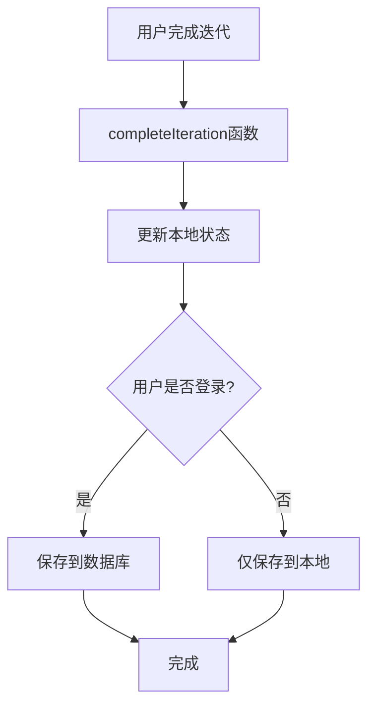
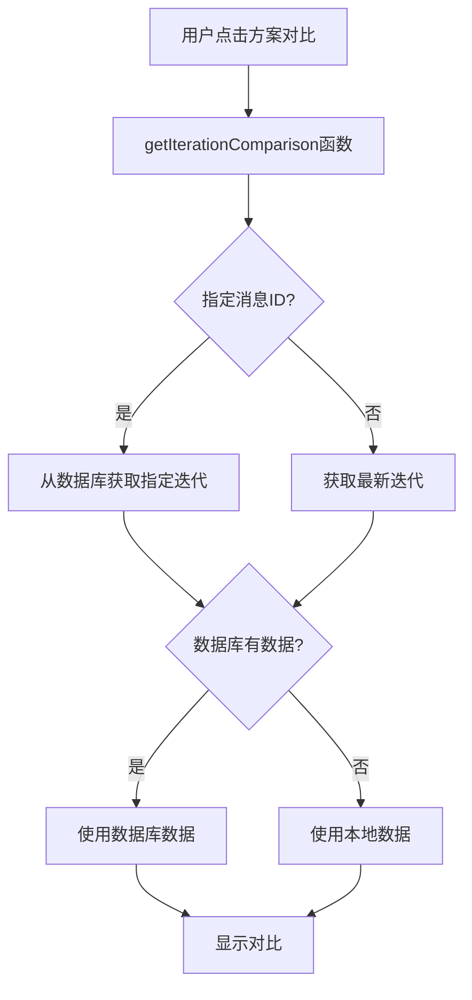

# 数据库迭代历史功能实现说明

## 📋 功能概述

为了解决方案对比功能在页面刷新后无法使用的问题，我们实现了基于数据库的方案迭代历史存储功能。该功能将迭代前后的方案快照持久化存储到数据库中，确保用户在任何时候都能查看方案的迭代对比。

## 🎯 解决的问题

### 原有问题
- 迭代快照数据只存储在内存中，页面刷新后丢失
- 方案对比功能在刷新后无法使用
- 多设备访问时数据不同步
- 数据安全性差，容易丢失

### 解决方案
- 在数据库中创建专门的迭代历史表
- 实现完整的CRUD API接口
- 前端优先从数据库获取数据，本地存储作为备用
- 支持多用户数据隔离

## 🗄️ 数据库设计

### 表结构：`plan_iterations`

```sql
CREATE TABLE plan_iterations (
  id INT AUTO_INCREMENT PRIMARY KEY,
  plan_id INT NOT NULL,
  user_id INT NOT NULL,
  iteration_type ENUM('full', 'partial') NOT NULL COMMENT '迭代类型：整体迭代或部分迭代',
  iteration_section VARCHAR(50) COMMENT '迭代的部分（如：hypotheses, methodology等）',
  iteration_suggestion TEXT COMMENT '迭代建议或说明',
  message_id VARCHAR(255) COMMENT '关联的AI消息ID',
  
  -- 迭代前的方案数据
  before_title VARCHAR(255),
  before_research_questions TEXT,
  before_methodology TEXT,
  before_data_collection TEXT,
  before_analysis_method TEXT,
  before_hypotheses TEXT,
  before_experimental_design TEXT,
  before_expected_results TEXT,
  before_variables TEXT,
  before_statistical_tools TEXT,
  before_visualization TEXT,
  before_source_introductions JSON,
  
  -- 迭代后的方案数据
  after_title VARCHAR(255),
  after_research_questions TEXT,
  after_methodology TEXT,
  after_data_collection TEXT,
  after_analysis_method TEXT,
  after_hypotheses TEXT,
  after_experimental_design TEXT,
  after_expected_results TEXT,
  after_variables TEXT,
  after_statistical_tools TEXT,
  after_visualization TEXT,
  after_source_introductions JSON,
  
  -- 元数据
  created_at TIMESTAMP DEFAULT CURRENT_TIMESTAMP,
  updated_at TIMESTAMP DEFAULT CURRENT_TIMESTAMP ON UPDATE CURRENT_TIMESTAMP,
  
  FOREIGN KEY (plan_id) REFERENCES research_plans(id) ON DELETE CASCADE,
  FOREIGN KEY (user_id) REFERENCES users(id) ON DELETE CASCADE,
  INDEX idx_plan_id (plan_id),
  INDEX idx_user_id (user_id),
  INDEX idx_iteration_type (iteration_type),
  INDEX idx_iteration_section (iteration_section),
  INDEX idx_message_id (message_id),
  INDEX idx_created_at (created_at)
) ENGINE=InnoDB DEFAULT CHARSET=utf8mb4 COLLATE=utf8mb4_unicode_ci;
```

### 字段说明

| 字段名 | 类型 | 说明 |
|--------|------|------|
| `id` | INT | 主键，自增 |
| `plan_id` | INT | 关联的研究方案ID |
| `user_id` | INT | 用户ID，确保数据隔离 |
| `iteration_type` | ENUM | 迭代类型：full（整体迭代）或partial（部分迭代） |
| `iteration_section` | VARCHAR(50) | 迭代的具体部分（如：hypotheses, methodology等） |
| `iteration_suggestion` | TEXT | 用户的迭代建议或说明 |
| `message_id` | VARCHAR(255) | 关联的AI消息ID，用于精确匹配 |
| `before_*` | TEXT/JSON | 迭代前的方案各字段数据 |
| `after_*` | TEXT/JSON | 迭代后的方案各字段数据 |
| `created_at` | TIMESTAMP | 创建时间 |
| `updated_at` | TIMESTAMP | 更新时间 |

## 🔧 后端实现

### 1. 数据库操作函数 (`server/plan-iterations-db.js`)

#### 核心函数

```javascript
// 存储方案迭代历史
export const storePlanIteration = async (iterationData) => {
  // 将迭代数据存储到数据库
}

// 获取方案的最新迭代历史
export const getLatestPlanIteration = async (planId, userId) => {
  // 获取指定方案的最新迭代记录
}

// 根据消息ID获取迭代历史
export const getIterationByMessageId = async (messageId, userId) => {
  // 通过消息ID精确获取迭代记录
}

// 获取方案的所有迭代历史
export const getPlanIterationHistory = async (planId, userId) => {
  // 获取方案的所有迭代记录
}

// 删除指定的迭代历史
export const deletePlanIteration = async (iterationId, userId) => {
  // 删除指定的迭代记录
}

// 清理方案的所有迭代历史
export const clearPlanIterations = async (planId, userId) => {
  // 清理方案的所有迭代记录
}
```

### 2. API接口 (`server/local-api.js`)

#### 接口列表

| 方法 | 路径 | 功能 |
|------|------|------|
| POST | `/api/plan-iterations` | 存储方案迭代历史 |
| GET | `/api/plan-iterations/latest/:planId` | 获取方案的最新迭代 |
| GET | `/api/plan-iterations/message/:messageId` | 根据消息ID获取迭代 |
| GET | `/api/plan-iterations/history/:planId` | 获取方案的所有迭代历史 |
| DELETE | `/api/plan-iterations/:iterationId` | 删除指定的迭代历史 |
| DELETE | `/api/plan-iterations/clear/:planId` | 清理方案的所有迭代历史 |

#### 请求示例

```javascript
// 存储迭代历史
const response = await fetch('/api/plan-iterations', {
  method: 'POST',
  headers: {
    'Content-Type': 'application/json',
    'Authorization': `Bearer ${token}`
  },
  body: JSON.stringify({
    planId: 1,
    iterationType: 'partial',
    iterationSection: 'hypotheses',
    iterationSuggestion: '增加更多假设',
    messageId: 'msg-123',
    beforeSnapshot: { /* 迭代前的方案数据 */ },
    afterSnapshot: { /* 迭代后的方案数据 */ }
  })
});
```

## 🎨 前端实现

### 1. Store更新 (`src/stores/chatStore.js`)

#### 修改的函数

```javascript
// 完成迭代 - 现在支持数据库存储
export const completeIteration = async (messageId) => {
  // 1. 更新本地状态
  // 2. 如果用户已登录，保存到数据库
  // 3. 保持向后兼容性
}

// 获取迭代对比 - 现在优先从数据库获取
export const getIterationComparison = async (messageId = null) => {
  // 1. 优先从数据库获取
  // 2. 备用本地存储
  // 3. 支持消息ID精确匹配
}
```

### 2. 组件更新 (`src/views/ResearchPlanDetail.vue`)

#### 修改的功能

```javascript
// 显示方案对比 - 现在支持数据库数据
const showPlanComparison = async () => {
  // 1. 尝试从数据库获取数据
  // 2. 备用本地数据
  // 3. 错误处理和用户提示
}
```

## 🔄 数据流程

### 1. 迭代完成流程



### 2. 方案对比流程



## 🧪 测试验证

### 测试页面

创建了专门的测试页面：`public/test-database-iteration.html`

#### 测试功能

1. **数据库连接测试** - 验证API服务器状态
2. **创建测试迭代** - 在数据库中创建测试记录
3. **获取最新迭代** - 验证数据检索功能
4. **根据消息ID获取** - 验证精确匹配功能
5. **获取迭代历史** - 验证历史记录功能
6. **删除迭代历史** - 验证删除功能
7. **清理所有迭代** - 验证批量清理功能

#### 使用方法

1. 启动开发服务器（端口3002）
2. 访问 `http://localhost:3002/test-database-iteration.html`
3. 按顺序执行测试操作
4. 查看测试结果和JSON数据

## 🔒 安全特性

### 1. 用户认证
- 所有API接口都需要JWT token认证
- 验证用户对方案的所有权

### 2. 数据隔离
- 通过 `user_id` 字段确保用户只能访问自己的数据
- 外键约束确保数据完整性

### 3. 输入验证
- 验证必要参数的存在
- 验证方案ID的有效性
- 防止SQL注入攻击

## 📈 性能优化

### 1. 数据库索引
- `plan_id` 索引：快速查找方案的迭代记录
- `user_id` 索引：确保用户数据隔离
- `message_id` 索引：支持精确匹配
- `created_at` 索引：支持时间排序

### 2. 缓存策略
- 前端优先使用数据库数据
- 本地存储作为备用方案
- 减少不必要的API调用

### 3. 错误处理
- 优雅降级：数据库失败时使用本地数据
- 用户友好的错误提示
- 详细的错误日志记录

## 🚀 部署说明

### 1. 数据库迁移
- 新表会在应用启动时自动创建
- 无需手动执行SQL脚本

### 2. 环境要求
- MySQL 5.7+ 或 MariaDB 10.2+
- 支持JSON数据类型
- 支持外键约束

### 3. 配置检查
- 确保数据库连接配置正确
- 验证用户权限（CREATE, INSERT, SELECT, DELETE）
- 检查字符集设置（utf8mb4）

## 🔮 未来扩展

### 1. 功能增强
- 支持迭代版本管理
- 添加迭代回滚功能
- 支持迭代分支管理

### 2. 性能优化
- 添加Redis缓存层
- 实现数据压缩存储
- 支持大数据量分页查询

### 3. 用户体验
- 添加迭代历史时间线
- 支持迭代对比可视化
- 提供迭代统计分析

## 📝 总结

通过实现基于数据库的方案迭代历史功能，我们成功解决了以下问题：

1. ✅ **数据持久化** - 迭代数据不再因页面刷新而丢失
2. ✅ **多设备同步** - 用户可以在不同设备上访问相同的迭代历史
3. ✅ **数据安全** - 通过数据库存储和用户认证确保数据安全
4. ✅ **向后兼容** - 保持与现有本地存储功能的兼容性
5. ✅ **用户体验** - 方案对比功能在任何时候都可用

该功能为MethodMate平台提供了更可靠、更安全的方案迭代管理能力，大大提升了用户的研究方案迭代体验。 