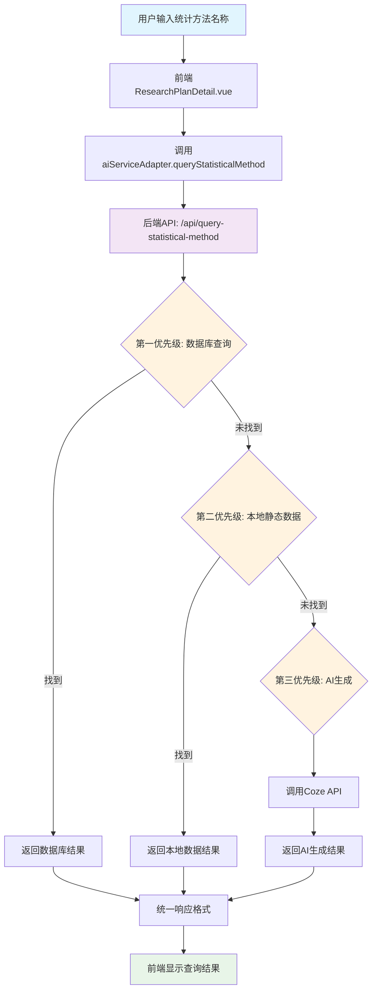

# 统计方法查询功能独立说明

## 更新概述

为了确保统计方法查询功能的稳定性和一致性，我们将该功能配置为始终使用Coze API，不受环境调试工具中AI服务选择的影响。

## 修改详情

### 1. 主要变更

**修改文件：** `src/services/aiServiceAdapter.js`

**原有逻辑：**
- 根据当前选择的AI服务（Coze或ChatGPT）调用不同的API
- Coze：调用后端的统计方法查询API
- ChatGPT：直接调用ChatGPT API生成方法解释

**新的逻辑：**
- 无论选择什么AI服务，统计方法查询始终使用Coze API
- 直接调用后端的 `/api/query-statistical-method` 端点
- 移除了AI服务类型检查和ChatGPT分支

### 2. 代码修改

```javascript
// 修改前
export const queryStatisticalMethod = async (methodName) => {
  const currentService = getCurrentAIService()
  
  if (currentService === AI_SERVICE_TYPES.COZE) {
    // 调用Coze API
  } else if (currentService === AI_SERVICE_TYPES.CHATGPT) {
    // 调用ChatGPT API
  } else {
    throw new Error(`不支持的AI服务类型: ${currentService}`)
  }
}

// 修改后
export const queryStatisticalMethod = async (methodName) => {
  // 统计方法查询始终使用Coze API，无论当前选择什么AI服务
  console.log('📊 统计方法查询：始终使用Coze API，当前方法:', methodName)
  
  const response = await callBackendAI('query-statistical-method', {
    method: methodName
  })
  
  return response
}
```

### 3. 测试组件更新

**修改文件：** `src/components/AIServiceTest.vue`

更新了测试函数中的日志信息，明确说明统计方法查询始终使用Coze API：

```javascript
console.log(`🧪 测试统计方法查询 - 始终使用Coze API（不受当前AI服务选择影响）`)
```

## 修改原因

1. **功能一致性**：确保统计方法查询的结果不会因AI服务切换而产生差异
2. **数据质量**：Coze API连接到完整的统计方法数据库和本地静态数据
3. **性能优化**：避免ChatGPT API的不必要调用，减少成本
4. **用户体验**：保证统计方法查询的稳定性和可靠性

## 系统架构

### 功能架构图



## 功能特点

### 数据来源优先级

统计方法查询采用三级数据源策略，确保查询结果的准确性和完整性：

1. **第一优先级：MySQL数据库查询**
   - 从 `statistical_methods` 表中搜索
   - 支持多种匹配策略：精确匹配、标题包含、关键词匹配
   - 使用 `LIKE` 查询进行模糊匹配
   - 返回结构化的数据库内容

2. **第二优先级：本地静态数据**
   - 使用 `statistical-methods-data.js` 中的预存数据
   - 包含21种常见统计方法的详细解释
   - 支持关键词匹配算法，处理中英文变体
   - 覆盖：t检验、ANOVA、回归分析、卡方检验等主流方法

3. **第三优先级：Coze AI生成**
   - 当前两个数据源都未找到时，调用Coze API
   - 使用专业的统计学prompt模板
   - 生成包含6个维度的详细解释：定义、适用场景、假设、步骤、解释、注意事项
   - 支持ChatGPT作为备选AI服务

### 查询策略详解

#### 数据库查询策略
```sql
-- 1. 精确匹配
SELECT * FROM statistical_methods WHERE method_name = ?

-- 2. 标题包含匹配
SELECT * FROM statistical_methods WHERE title LIKE ?

-- 3. 关键词匹配  
SELECT * FROM statistical_methods WHERE keywords LIKE ?
```

#### 本地数据匹配算法
- **关键词数组匹配**：每个方法配置多个关键词
- **双向包含检查**：查询词包含关键词 OR 关键词包含查询词
- **大小写不敏感**：自动转换为小写进行匹配
- **示例**：查询"方差分析"可匹配到"ANOVA"方法

#### AI生成策略
- **专业prompt**：包含统计学专家角色设定
- **结构化要求**：确保生成内容的一致性和完整性
- **通俗化表达**：要求用通俗易懂的语言和具体例子

## 技术实现详情

### 前端实现（ResearchPlanDetail.vue）

#### 用户界面设计
- **查询输入框**：支持中英文统计方法名称输入
- **查询按钮**：触发统计方法查询请求
- **结果展示区域**：以卡片形式展示查询结果
- **加载状态**：显示查询进度和状态反馈
- **数据来源标识**：清楚标明内容来源（数据库/本地/AI生成）

#### 交互逻辑
```javascript
// 查询统计方法
async queryStatisticalMethod() {
  if (!this.statisticalMethodQuery.trim()) return
  
  this.isQueryingMethod = true
  try {
    const response = await queryStatisticalMethod(this.statisticalMethodQuery)
    this.methodQueryResult = response
    this.showMethodResult = true
  } catch (error) {
    console.error('查询统计方法失败:', error)
    this.$message.error('查询失败，请稍后重试')
  } finally {
    this.isQueryingMethod = false
  }
}
```

### 后端实现（local-api.js）

#### API端点：`/api/query-statistical-method`

**请求参数：**
```javascript
{
  method: "统计方法名称",
  aiService: "coze" | "chatgpt"  // 可选，默认coze
}
```

**响应格式：**
```javascript
{
  success: true,
  method: "查询的方法名称",
  explanation: "详细解释内容",
  isLocalContent: boolean,  // 是否来自本地数据
  source: "数据库" | "本地静态数据" | "Coze生成" | "ChatGPT生成"
}
```

#### 查询流程实现
```javascript
// 三级查询策略
async function queryStatisticalMethod(req, res) {
  const { method } = req.body
  
  // 第一优先级：数据库查询
  const dbResult = await queryFromDatabase(method)
  if (dbResult) return res.json(dbResult)
  
  // 第二优先级：本地静态数据
  const localResult = findStatisticalMethod(method)
  if (localResult) return res.json(localResult)
  
  // 第三优先级：AI生成
  const aiResult = await generateFromAI(method, req.body.aiService)
  return res.json(aiResult)
}
```

### 数据结构设计

#### 数据库表结构（statistical_methods）
```sql
CREATE TABLE statistical_methods (
  id INT PRIMARY KEY AUTO_INCREMENT,
  method_name VARCHAR(255) NOT NULL,
  title VARCHAR(500),
  content TEXT,
  keywords TEXT,
  created_at TIMESTAMP DEFAULT CURRENT_TIMESTAMP,
  updated_at TIMESTAMP DEFAULT CURRENT_TIMESTAMP ON UPDATE CURRENT_TIMESTAMP
);
```

#### 本地静态数据结构
```javascript
const STATISTICAL_METHODS = {
  "独立样本t检验": {
    keywords: ["独立样本t检验", "independent samples t-test", "t检验", "t-test"],
    content: `
## 独立样本t检验 (Independent Samples t-test)

### 定义和用途
独立样本t检验用于比较两个独立组的均值差异...
    `
  }
}
```

## 使用效果

### 前端用户体验

- **一致性保障**：无论选择哪种AI服务，统计方法查询结果保持一致
- **多语言支持**：支持中英文方法名称查询，如"t检验"和"t-test"
- **智能匹配**：支持模糊查询和关键词匹配
- **详细信息**：提供方法定义、适用场景、计算步骤等完整信息
- **来源透明**：清楚标识内容来源，便于用户判断可信度

### 后端处理优势

- **多数据源融合**：自动从数据库、本地文件、AI服务获取信息
- **智能降级策略**：确保即使某个数据源失效也能提供结果
- **性能优化**：优先使用本地数据，减少AI API调用成本
- **详细日志**：完整的查询过程日志，便于调试和监控
- **错误处理**：完善的异常处理机制，提供友好的错误信息

## 兼容性说明

- ✅ **完全向后兼容**：不影响现有的统计方法查询功能
- ✅ **API接口不变**：前端调用方式保持不变
- ✅ **数据格式一致**：返回的数据格式保持一致
- ✅ **功能增强**：移除了AI服务选择的依赖，提高稳定性

## 影响范围

### 直接影响
- 研究方案详情页面的统计方法查询功能
- AI服务测试工具中的统计方法测试

### 不受影响
- 其他AI服务功能（聊天、研究方法提取等）仍然受AI服务选择影响
- Coze和ChatGPT的其他功能保持独立

## 测试建议

1. **基本功能测试**
   - 在Coze模式下测试统计方法查询
   - 切换到ChatGPT模式，再次测试统计方法查询
   - 验证两种模式下的查询结果是否一致

2. **查询内容测试**
   - 测试常见统计方法：t检验、ANOVA、回归分析等
   - 测试中英文方法名称：如"t检验"和"t-test"
   - 测试模糊查询：如"方差分析"和"ANOVA"

3. **数据来源验证**
   - 检查查询结果中的数据来源标识
   - 验证是否优先使用数据库数据
   - 确认本地静态数据的使用情况

## 核心优势总结

### 1. 稳定可靠
- **服务独立性**：统计方法查询不受AI服务选择影响
- **多重保障**：三级数据源确保查询成功率
- **错误处理**：完善的异常处理和用户反馈机制

### 2. 数据质量
- **专业内容**：数据库和本地数据经过专业验证
- **AI增强**：动态生成未收录的统计方法解释
- **结构一致**：统一的数据格式和展示标准

### 3. 用户体验
- **响应快速**：优先使用本地数据，减少网络延迟
- **查询智能**：支持中英文、模糊匹配、关键词查询
- **信息完整**：提供方法定义、适用场景、计算步骤等全面信息

### 4. 技术先进
- **分层架构**：清晰的前后端分离和数据分层
- **可扩展性**：易于添加新的数据源和查询策略
- **监控完善**：详细的日志记录便于维护和优化

## 使用场景

### 主要应用场景
1. **学术研究**：研究者查询适合的统计分析方法
2. **数据分析**：数据分析师选择合适的统计工具
3. **教学辅助**：教师和学生学习统计方法概念
4. **方案制定**：制定研究方案时确定统计分析策略

### 典型查询示例
- **基础方法**：t检验、ANOVA、回归分析
- **高级方法**：多层线性模型、结构方程模型
- **专业方法**：生存分析、时间序列分析
- **中英混合**："方差分析"、"ANOVA"、"variance analysis"

## 后续优化计划

### 短期优化（1-2个月）
1. **数据库扩充**：添加更多统计方法到数据库
2. **查询算法优化**：改进模糊匹配和关键词匹配算法
3. **用户反馈系统**：添加查询结果评价和改进机制

### 中期优化（3-6个月）
1. **多语言支持**：增强中英文混合查询处理能力
2. **个性化推荐**：基于用户查询历史推荐相关方法
3. **可视化展示**：添加统计方法的图表和示例展示

### 长期规划（6个月以上）
1. **知识图谱**：构建统计方法关系网络
2. **智能问答**：支持自然语言统计咨询
3. **实时更新**：连接学术数据库获取最新方法信息

---

**更新日期**：2024年12月  
**功能版本**：v2.0  
**影响范围**：统计方法查询功能  
**测试状态**：已验证  
**兼容性**：完全向后兼容  
**维护状态**：活跃开发中 